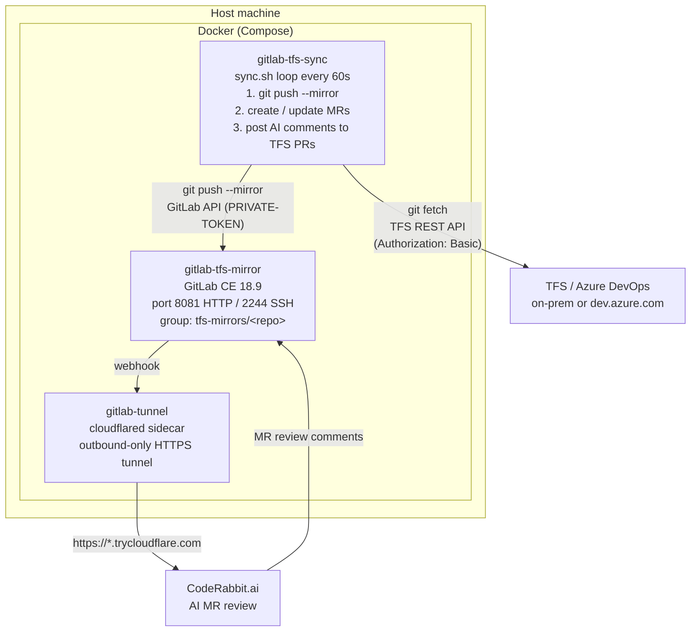

# TFS / Azure DevOps → GitLab Mirror with CodeRabbit AI Review

Mirrors **TFS / Azure DevOps** Git repositories into a self-hosted **GitLab CE 18.9** instance,
exposes it through a **Cloudflare Tunnel**, and feeds **CodeRabbit AI** review comments
back to the originating TFS pull requests — all managed by a cross-platform PowerShell 7 script.

---

## Architecture



### Components

| Component | Container name | Image | Purpose |
|-----------|---------------|-------|---------|
| **GitLab CE** | `gitlab-tfs-mirror` | `gitlab-gitlab:latest` | Hosts the mirrored repos; receives git pushes; generates Merge Requests; serves webhooks to CodeRabbit |
| **Sync service** | `gitlab-tfs-sync` | `gitlab-tfs-sync:latest` | Alpine + bash + git; runs `sync.sh` in a continuous loop — mirrors git history, bridges TFS PRs to GitLab MRs, posts AI review comments back to TFS |
| **Cloudflare Tunnel** | `gitlab-tunnel` | `cloudflare/cloudflared` | Optional sidecar; creates an outbound-only HTTPS tunnel so CodeRabbit can reach GitLab without opening inbound firewall ports |

### Data flows

```
TFS PAT ──► sync.sh ──► git fetch (TFS) ──► git push --mirror (GitLab)
                    ──► TFS REST API   ──► GitLab MR API (create / update / close MRs)
                    ──► GitLab MR API  ──► TFS PR Threads API (post CodeRabbit comments)
```

### Storage

Three named Docker volumes survive container restarts:

| Volume | Mount | Contents |
|--------|-------|----------|
| `gitlab_config` | `/etc/gitlab` | GitLab configuration |
| `gitlab_logs` | `/var/log/gitlab` | GitLab logs |
| `gitlab_data` | `/var/opt/gitlab` | Repos, database, uploads |
| `tfs_repos` | `/repos` (sync) | Bare git mirrors used by sync |

`-Destroy` removes containers and images but **not** volumes.
To wipe everything: `docker compose down -v --rmi local`.

---

## Prerequisites

- Docker Engine 20.10+ with Compose v2
- Git
- PowerShell 7+ (`snap install powershell` on Linux / `brew install powershell` on macOS)
- `curl` (pre-installed on macOS and most Linux distros)
- 4 GB RAM minimum (8 GB recommended), 2+ CPU cores, 10 GB free disk

---

## Quick Start

### 1. Start GitLab

```powershell
./gitlab-tfs.ps1 -Setup        # check prereqs, create .env, build image
# edit .env — set GITLAB_ROOT_PASSWORD at minimum
./gitlab-tfs.ps1 -Start        # start container; auto-opens browser when ready
```

Login → `http://localhost:8081` · user **`root`** · password from `.env`

### 2. Connect to TFS / Azure DevOps

#### 2a. Create a TFS Personal Access Token

**Azure DevOps (dev.azure.com):**
1. Go to `https://dev.azure.com/<org>` → click your avatar (top-right) → **Personal access tokens**
2. Click **New Token**
3. Set a name, select your organisation, choose expiry
4. Under **Scopes** select **Custom defined** and tick:
   - **Code** → Read
   - **Pull Request Threads** → Read & Write
5. Click **Create** and copy the token immediately (shown only once)

**TFS on-premises:**
1. Open `https://<tfs-host>/tfs/<collection>` → click your avatar → **Security**
2. Click **Add** under Personal Access Tokens
3. Tick **Code (read)** and **Pull Request Threads (Read & Write)**
4. Copy the token

#### 2b. Run the setup wizard

```powershell
./gitlab-tfs.ps1 -TFSSetup
```

The wizard will:
1. Check GitLab is healthy
2. Prompt for:
   - **TFS collection URL** — end at the collection, do **not** include the project name
     ```
     https://dev.azure.com/myorg               # Azure DevOps
     https://tfs.company.com/tfs/DefaultCollection  # on-premises
     ```
   - **Team project name** — e.g. `MyProject`
   - **PAT** — the token created above (input masked)
3. Test connectivity and list all repos in the project
4. Ask which repos to mirror (Enter = all, or comma-separated names)
5. Create a dedicated GitLab PAT for the sync container
6. Save everything to `.env` and start the `gitlab-tfs-sync` container

#### 2c. Monitor mirroring progress

```powershell
./gitlab-tfs.ps1 -TFSProgress  # per-repo status: branches, last sync, URL
./gitlab-tfs.ps1 -TFSLogs      # live sync log stream
```

The first clone of a large repo can take 10–30 minutes. Once complete the repo appears at:
`http://localhost:8081/tfs-mirrors/<repo-name>`

### 3. Set up CodeRabbit AI review (optional)

```powershell
./gitlab-tfs.ps1 -Tunnel        # start Cloudflare tunnel, get public URL
./gitlab-tfs.ps1 -CodeRabbit    # create GitLab PAT, open CodeRabbit.ai
```

Paste the displayed **GitLab URL** and **Access Token** into CodeRabbit. It will register a webhook and begin reviewing every new MR automatically.

---

## Commands

Run with no arguments for an interactive menu, or pass a flag directly:

### GitLab management

| Flag | Description |
|------|-------------|
| `-Setup` | Check prereqs, create `.env`, build image |
| `-Start` | Start container (detached), open browser when ready |
| `-Stop` | Stop and remove container |
| `-Restart` | Restart container |
| `-Logs` | Stream container logs |
| `-Status` | Show container state and health |
| `-Backup` | Save `.env` to `backups/<timestamp>/` |
| `-Export` | Save Docker image to `.tar.gz` |
| `-Import -File <path>` | Load Docker image from `.tar.gz` |
| `-OpenBrowser` | Open GitLab in the default browser |
| `-Destroy` | Remove container + image (confirms first) |
| `-Help` | Show usage |

### Integrations

| Flag | Description |
|------|-------------|
| `-Tunnel` | Start Cloudflare tunnel & test connectivity |
| `-CodeRabbit` | Set up CodeRabbit AI code review |
| `-TFSSetup` | Configure TFS/Azure DevOps mirroring (interactive wizard) |
| `-TFSStatus` | Show sync container state + recent log |
| `-TFSSyncNow` | Restart sync container (triggers immediate sync cycle) |
| `-TFSLogs` | Stream live TFS sync logs |
| `-TFSProgress` | Per-repo mirror status: branch count, last activity, GitLab URL |

---

## Environment Variables (`.env`)

### GitLab

| Variable | Default | Description |
|----------|---------|-------------|
| `GITLAB_HTTP_PORT` | `8081` | Host HTTP port |
| `GITLAB_SSH_PORT` | `2244` | Host SSH port |
| `GITLAB_ROOT_PASSWORD` | `ChangeMe123!` | Initial root password |
| `GITLAB_HOSTNAME` | `gitlab.local` | Hostname used in `external_url` |
| `GITLAB_TIMEZONE` | `UTC` | Time zone |

### TFS / Azure DevOps (written by `-TFSSetup`)

| Variable | Description |
|----------|-------------|
| `TFS_URL` | Collection URL, e.g. `https://dev.azure.com/myorg` |
| `TFS_PROJECT` | Team project name |
| `TFS_PAT` | TFS Personal Access Token (Code read + PR Threads read/write) |
| `TFS_REPOS` | Comma-separated repo names to mirror (empty = all) |
| `GITLAB_TFS_TOKEN` | GitLab PAT used by the sync container (created by `-TFSSetup`) |
| `GITLAB_TFS_NAMESPACE` | GitLab group for mirrored repos (default: `tfs-mirrors`) |
| `TFS_SYNC_INTERVAL` | Seconds between sync cycles (default: `60`) |

---

## How the Sync Works

The `gitlab-tfs-sync` container runs `sync.sh` in a continuous loop. Each cycle does:

| Step | What happens |
|------|--------------|
| **Git mirror** | `git clone --mirror` (first run) or `git remote update --prune` (subsequent) from TFS using `http.extraHeader` Basic auth; then `git push --mirror` to GitLab |
| **PR bridge** | For every active TFS PR that has no corresponding GitLab MR: creates a mirror MR labelled `tfs-pr` with the TFS PR id embedded in the description |
| **Review feedback** | For every GitLab MR with new CodeRabbit comments since the last cycle: posts them as thread replies on the originating TFS PR |
| **Cleanup** | Closes GitLab MRs whose TFS PRs have been completed or abandoned |

**Authentication:**
- TFS git ops use `git -c http.extraHeader="Authorization: Basic <base64(PAT)>"` — this preserves the auth header across HTTP redirects (on-premises TFS typically issues redirects)
- TFS REST API calls use `curl --location-trusted -H "Authorization: Basic …"` for the same reason
- GitLab git pushes use `oauth2:<GITLAB_TFS_TOKEN>@` in the URL
- GitLab REST API calls use `PRIVATE-TOKEN: <GITLAB_TFS_TOKEN>`

---

## Cloudflare Tunnel

The tunnel creates an outbound-only HTTPS connection — no inbound ports, no Cloudflare account required.

```powershell
./gitlab-tfs.ps1 -Tunnel    # starts if not running, prints public URL
```

The tunnel runs under the `tunnel` Docker Compose profile and does **not** start with `-Start`. The URL changes on each restart. For a permanent URL, configure a [named Cloudflare Tunnel](https://developers.cloudflare.com/cloudflare-one/connections/connect-networks/) with a custom domain.

---

## CodeRabbit (AI Code Review)

`-CodeRabbit` is a single end-to-end wizard that:
1. Verifies GitLab is healthy
2. Ensures the Cloudflare tunnel is running and retrieves its public URL
3. Tests tunnel reachability from the internet
4. Creates a scoped GitLab PAT (`api`, `read_user`, `read_repository`) via the Rails console
5. Opens `https://app.coderabbit.ai` and displays the values to paste:
   - **GitLab URL** — the `*.trycloudflare.com` public address
   - **Access Token** — the generated PAT

CodeRabbit registers a webhook into GitLab automatically. Every new MR receives an AI review. Copy `.coderabbit.yaml` to a repo root to customise review rules.

> **Note:** The free tunnel URL changes on restart. Use a named tunnel for a stable URL.

---

## Backup & Restore

`-Backup` saves `.env` only. For a full GitLab data backup:

```bash
docker exec gitlab-tfs-mirror gitlab-backup create
docker cp gitlab-tfs-mirror:/var/opt/gitlab/backups/ ./backups/
```

---

## Troubleshooting

| Symptom | Fix |
|---------|-----|
| Port already in use | Change `GITLAB_HTTP_PORT` in `.env` and restart |
| GitLab not ready after 5 min | Run `-Logs`; GitLab needs ≥ 4 GB RAM |
| Browser doesn't open automatically | Run `-OpenBrowser` or navigate to `http://localhost:<port>` |
| Sync container keeps restarting | Run `-TFSLogs` to see the error; most common cause is an invalid `GITLAB_TFS_TOKEN` — re-run `-TFSSetup` to regenerate it |
| TFS clone fails with `Authentication failed` | Verify the PAT has **Code (read)** scope and hasn't expired; re-run `-TFSSetup` |
| TFS clone fails with `url contains a newline` | Update to the latest `sync.sh` (bug fixed in commit `00a9dd6`) |
| Repo not appearing in GitLab after long wait | Run `-TFSProgress` to check per-repo status and `-TFSLogs` for errors |
| CodeRabbit webhook not firing | Tunnel URL may have changed — re-run `-CodeRabbit` |
| GitLab API returns 401 for sync | `GITLAB_TFS_TOKEN` is truncated or expired — re-run `-TFSSetup` to create a fresh token |

---

## Security

- `.env` contains passwords and tokens — **never commit it** (it is in `.gitignore`)
- Rotate the GitLab root password after first login
- TFS PATs should be scoped to the minimum required permissions (Code read + PR Threads read/write)
- The Cloudflare tunnel exposes GitLab publicly — ensure `GITLAB_ROOT_PASSWORD` is strong
